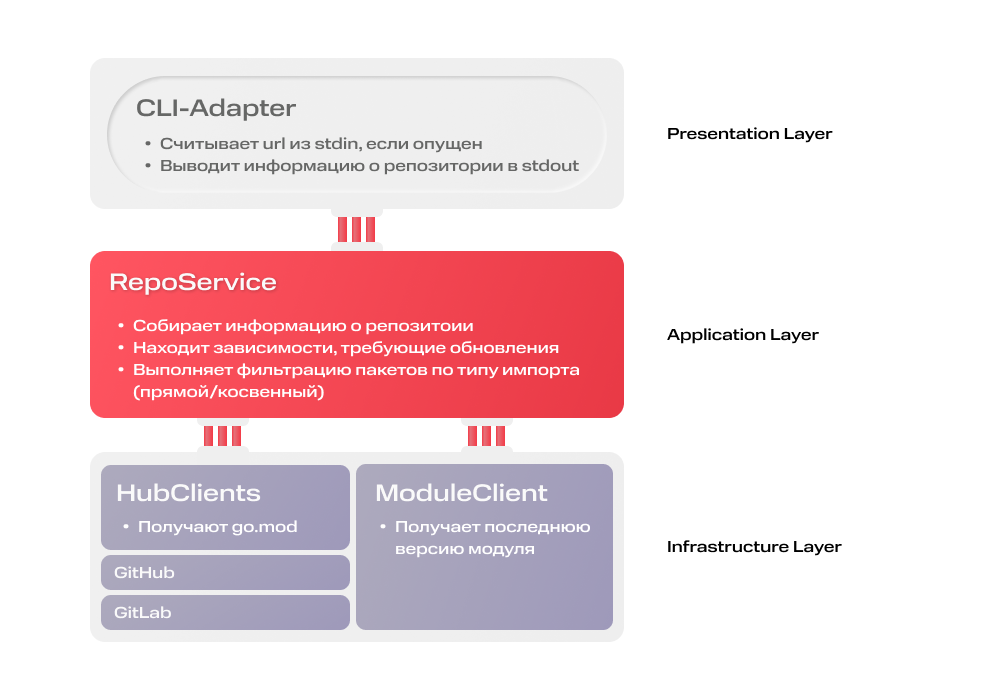

# Тестовое задание для отобора на стажировку в MWS

Данный репозиторий содержит решение тестового задания для отбора на стажировку в MTS Web Servicies (осень 2025).

**Задача**: Для указанного репозитория вывести данные о модуле и список зависимостей, которые можно обновить.

**Результат**: CLI которая на вход получает адрес гит репо, на выходе имя модуля, версия golang и список зависимостей для обновления.

## Быстрый старт

1. Склонируйте этот репозиторий:
```
git clone https://github.com/SmokingElk/MWS-2025-Autumn-Intership.git
```

2. Соберите приложение:
```
go build -o ./update-checker.out ./cmd/main.go
или
make build
```

3. Запустите приложение:
```
./update-checker.out --url=https://github.com/SmokingElk/Update-Checker-Test --verbose
```

Результат:
```
MODULE: update-checker-test
GO VERSION: v1.24.0
==========
github.com/golang/mock             | CURRENT    v1.5.0 | LAST    v1.6.0 | DIRECT
github.com/ilyakaznacheev/cleanenv | CURRENT    v0.5.0 | LAST    v1.5.0 | DIRECT
github.com/stretchr/testify        | CURRENT   v1.11.0 | LAST   v1.11.1 | DIRECT
```

*Примечание: в примерах запуска используется этот [тестовый репозиторий](https://github.com/SmokingElk/Update-Checker-Test)*


## Использование

Приложение может принимать следующие аргументы:
- `--help` - вывести информацию об использовании
- `--url` - ссылка на репозиторий (если параметр опущен, запрашивается через поток ввода)
- `--show-indirect` - показывать модули с косвенным (indirect) импортом, если их можно обновить
- `--verbose` - вывести информацию в расширенном виде (текущую и последнюю версию зависимости, тип импорта)
- `--timeout-seconds` - таймаут для сбора информации о репозитории в секундах (значение по умолчанию - 10)
- `--config-path` - путь к yml-конфигу с чувствительными данными. Пример конфига смотри в файле `update-checker-config.example.yml`.
В данной реализации позволяет указать Auth-токен для доступа к API GitHub, что увеличивает лимиты.

Пример вывода с отображением косвенных зависимостей:
```
./update-checker --url=https://github.com/SmokingElk/Update-Checker-Test --verbose --show-indirect

MODULE: update-checker-test
GO VERSION: v1.24.0
==========
github.com/golang/mock             | CURRENT    v1.5.0 | LAST    v1.6.0 | DIRECT
github.com/google/go-querystring   | CURRENT    v1.0.0 | LAST    v1.1.0 | INDIRECT
github.com/ilyakaznacheev/cleanenv | CURRENT    v0.5.0 | LAST    v1.5.0 | DIRECT
github.com/joho/godotenv           | CURRENT    v1.5.0 | LAST    v1.5.1 | INDIRECT
github.com/stretchr/testify        | CURRENT   v1.11.0 | LAST   v1.11.1 | DIRECT
```

Пример вывода информации в компактном виде:
```
./update-checker --url=https://github.com/SmokingElk/Update-Checker-Test      
update-checker-test                                         
v1.24.0
github.com/golang/mock
github.com/ilyakaznacheev/cleanenv
github.com/stretchr/testify
```


## Архитектура

Решение написано с использованием подхода DDD. Схема взаимодействия его модулей представлена на схеме:



- `CLIAdapter` - точка входа в приложение через command line. Считывает ссылку на репозиторий из потока ввода (если она не передана
в параметре) и выводит информацию о репозитории. 
- `RepoService` - компонент, реализующий бизнес-логику приложения. Выполняет считывание информации о репозитория из файла `go.mod`,фильтрацию зависимостей по типу импорта (прямой или косвенный), определяет, для каких зависимостей возможно обновление.
- `HubClients` - клиенты хабов с Git-репозиториями. Загружают файл `go.mod`. В данном решение представлен только клиент для GitHub, но 
предусмотренна возможность расширения клиентами других сервисов (например, GitLab).
- `ModuleClient` - клиент, получающий информацию о последней версии модуля. В данном решении использует API golang proxy.


## Особенности и технические решения

Особенности:
- Слои *Presentation* и *Application* покрыты тестами на 90%+. Для *Presentation* слоя написаны интеграционные тесты.
- В репозиторий включена конфигурация линтера (смотри файл `.golangci.yml`).
- Настроены пайплайны GitHub Actions для автоматического запуска тестов и линтера перед слиянием `feature`-веток с `develop`.

Технические решения:
- Для работы с GitHub API использован следующий [SDK](https://pkg.go.dev/github.com/google/go-github/v62@v62.0.0/github).
- Информация о модуле, версии golang и используемых в репозитории зависимостях извлекается из файла `go.mod`. Для его разбора
использован официальный [модуль](https://pkg.go.dev/golang.org/x/mod/modfile).
- Приложение получает актуальные версии модулей при помощи API golang proxy.
- Актуальность зависимости проверяется на основе сравнения частей *major*, *minor* и *patch* в версиях.
- Для извлечения логики построения объекта репозитория из *Infrastructure*-слоя в *Application*-слой использован принцип *IOC*:
в метод клиента передается описанный в слое бизнес-логики callback, который клиент вызывает и передает туда содержимое
`go.mod` в случае его успешного считывания.
- Для мокирования клиентов в тестах используется пакет [gomock](https://pkg.go.dev/github.com/golang/mock/gomock).
- `CLIAdapter` при запуске приложения получает объекты, реализующие интерфейсы `io.Reader` и `io.Writer`. При сборке приложения
в качестве этих объектов передаются стандартные потоки ввода и вывода, а в тестах - буферы для мокирования пользовательского ввода
и сравнения результата с ожидаемым.